# metarchart
#### A python web app for plotting METAR data.

## Contents
1. [Description](#description)
2. [Features](#features)
   - [Station overview](#station-overview)
   - [Single variable](#single-variable)
   - [Responsive design](#responsive-design)
3. [Usage](#usage)
   - [Station overview](#station-overview-1)
   - [Single variable](#single-variable-1)
   - [Hiding the settings area](#hiding-the-settings-area)
4. [Interpreting the plots](#interpreting-the-plots)
   - [Cloud base](#cloud-base)
   - [Visibility/weather](#visibilityweather)
   - [Wind (combined)](#wind-combined)
   - [Temperature/dew point](#temperaturedew-point)
   - [QNH pressure or other single variable](#qnh-pressure-or-other-single-variable)
5. [Structure](#structure)

## Description
_metarchart_ is designed to allow you to visualise the meteorological variables reported in [Meteorological Aerodrome Reports](https://en.wikipedia.org/wiki/METAR) (METARs).

## Features
### Station overview
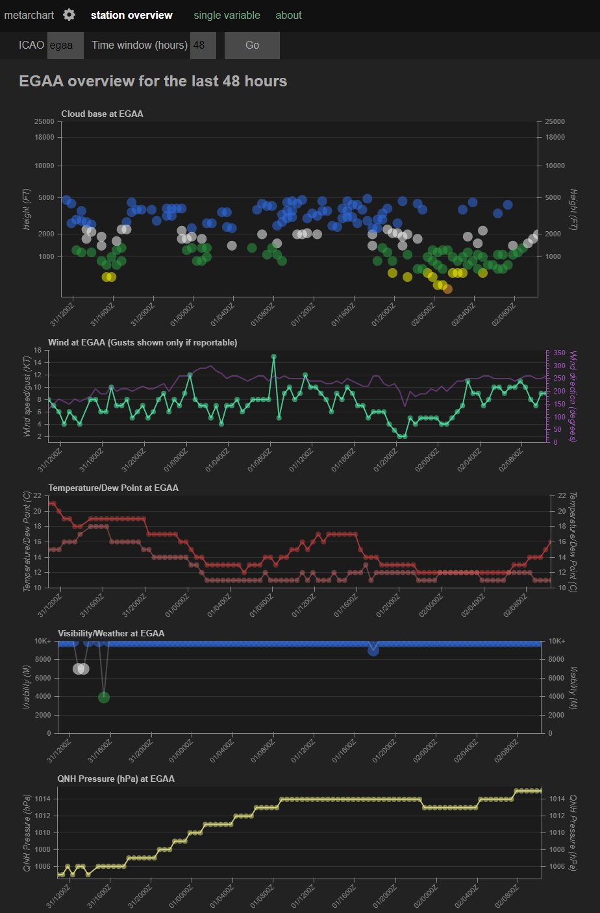 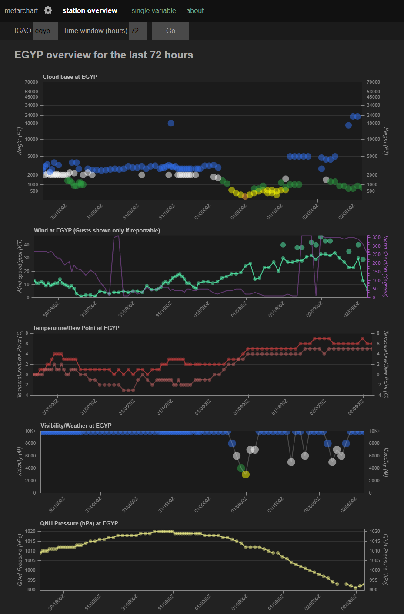 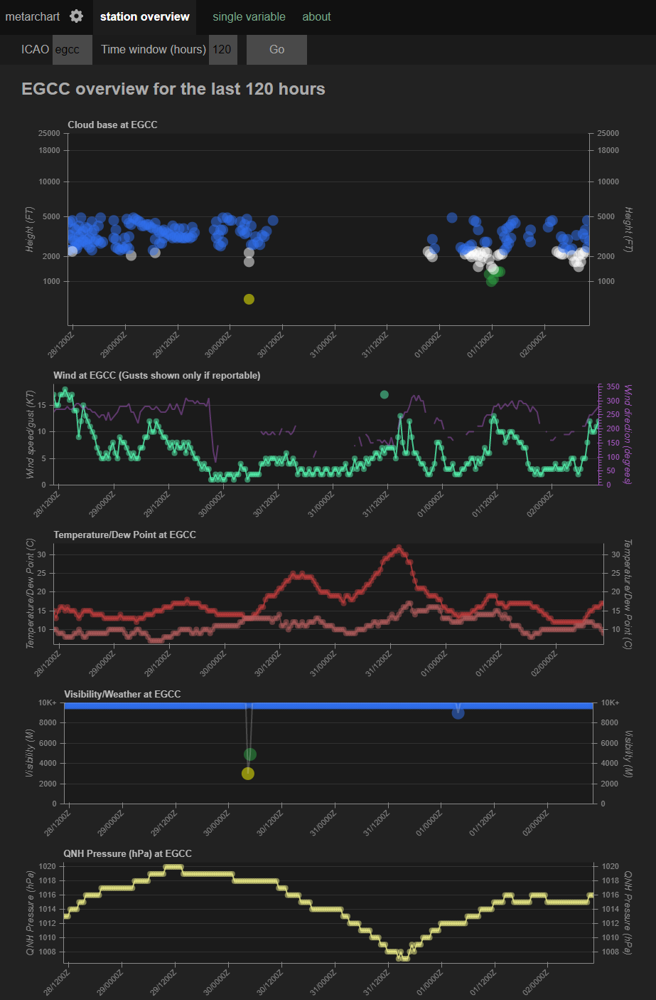  

Station overview shows a set of plots covering all the core meteorological variables reported in a METAR, for a single specified station. The variables shown are:
- Cloud base
- Wind direction and speed (Gusts are included if reported)
- Temperature and dew point
- Visibility and any significant weather reported
- QNH pressure

### Single variable
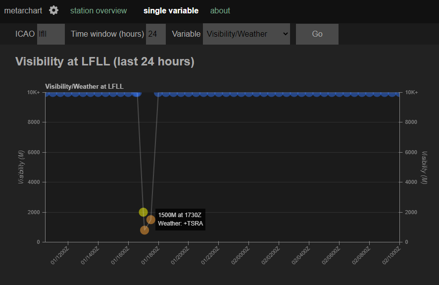  

Single variable plots allow you to view a single plot of a chosen variable for a specified station. The variables available are:
- Cloud base
- Wind direction and speed (Gusts are included if reported)
- Visibility and any significant weather reported
- Temperature
- Dew point
- QNH pressure
- Wind speed
- Wind direction
- Wind gust (if reported)
  
### Responsive design
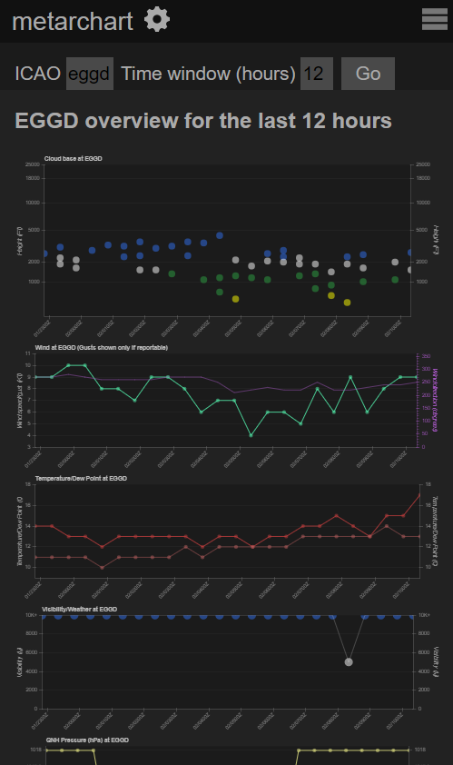 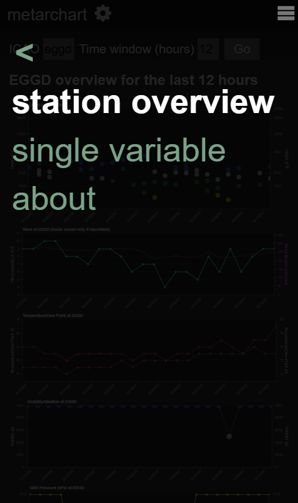  

Responsive design means that the web app is optimised for use on mobile devices.

## Usage
### Station overview
Enter an [ICAO airport code](https://en.wikipedia.org/wiki/ICAO_airport_code) in the _ICAO_ box. Enter your desired time window in hours (Default is 24 hours; ie covering the last 24 hours from the current time). Press "Go" to view the plots.  
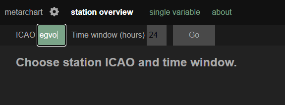

### Single variable
Enter an [ICAO airport code](https://en.wikipedia.org/wiki/ICAO_airport_code) in the _ICAO_ box. Enter your desired time window in hours (Default is 24 hours; ie covering the last 24 hours from the current time). Select the variable you wish to view from the dropdown menu. Press "Go" to view the plots.  
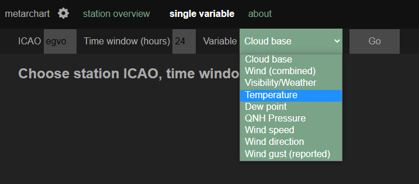

### Hiding the settings area
It is possible to toggle the settings area on and off by pressing the cog/wheel icon to the right of _metarchart_ at the top left of the screen.  
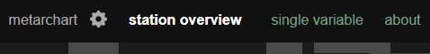

## Interpreting the plots
#### Cloud base
Each reported cloud base is shown as a coloured dot. They are colour-coded according to UK Military colour states. Cloud amounts of FEW are shown with lower opacity. Hovering over or tapping each point will show the reported cloud base & amount and time of observation.  

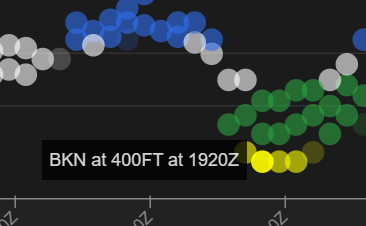

#### Visibility/weather
Each reported visibility is shown as a coloured dot. They are colour-coded according to UK Military colour states. Hovering over or tapping each point will show the reported visibility, time of observation and any significant weather reported at that time.  

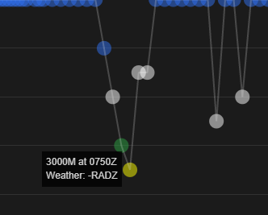

#### Wind (combined)
Wind direction is plotted in purple against the scale on the right. Wind speed is plotted in green against the scale on the left. If any wind gusts are reported in the METARs, they will be shown as larger green dots "floating" above the main wind speed. Hovering over or tapping each point will show the reported wind direction and speed and time of observation. Any gusts at that time will also be shown.  

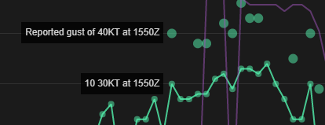

#### Temperature/dew point
Temperature is plotted in red, and dew point in a fainter red. Hovering over or tapping each point will show the reported temperature, dewpoint and time of observation. 

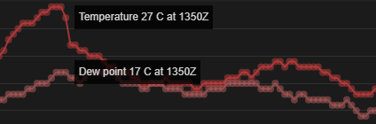

#### QNH pressure or other single variable
QNH pressure, or any other standard single variable plot will show that variable in yellow. Hovering over or tapping each point will show the reported value of the variable and time of observation.  

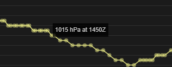

## Structure
[Flask](https://github.com/pallets/flask), [WTForms](https://github.com/wtforms/wtforms) and [Bokeh](https://github.com/bokeh/bokeh) are used for the front end, while [python-metar](https://github.com/python-metar/python-metar), [requests](https://github.com/psf/requests) and [numpy](https://github.com/numpy/numpy) are used to acquire and process the data.